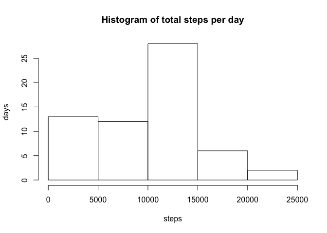
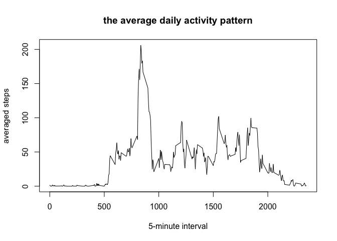
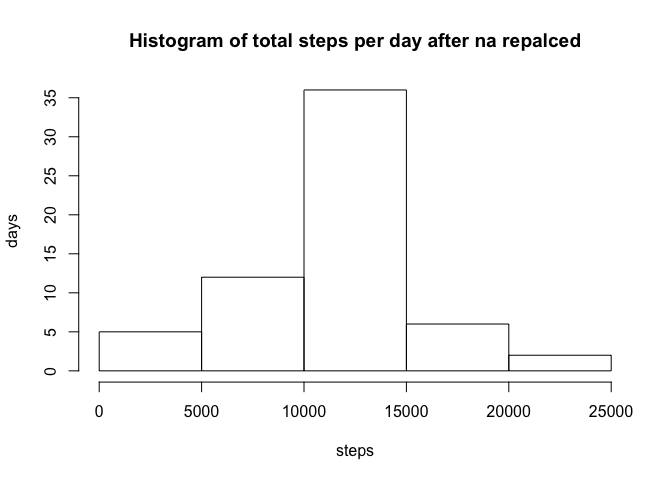

# Reproducible Research:My Assessment 1
load data

```r
data<-read.csv('activity.csv')
```

caculate the total steps by day:

```r
tsd<-aggregate(data$steps,by=list(date=data$date), FUN=sum,na.rm=TRUE)
```

the histogram of total steps per day:

```r
hist(tsd[,2],xlab="steps",ylab='days',main='Histogram of total steps per day')
```

 

the mean of the total number of steps taken per day:

```r
mean(tsd[,2])
```

```
## [1] 9354.23
```
the median of the total number of steps taken per day:

```r
median(tsd[,2])
```

```
## [1] 10395
```

the average daily activity pattern:

```r
 asi<-aggregate(data$steps,by=list(interval=data$interval), FUN=mean,na.rm=TRUE)
 plot(asi,type='l',xlab='5-minute interval',ylab='averaged steps',main='the average daily activity pattern')
```

 

The 5-minute interval,on average across all the days in the dataset, contains the maximum number of steps is:

```r
asi[which.max(asi[,2]),1]
```

```
## [1] 835
```

the total number of rows with NAs:

```r
sum(is.na(data$steps))
```

```
## [1] 2304
```

use the mean steps of that interval to replace the NA value and create a new dataset like this:


```r
ndata<-data;
for(i in 1:nrow(ndata)){
        if(is.na(ndata[i,1])=='TRUE'){
                ndata[i,1]<-asi[which(ndata[i,'interval']==asi$interval),2]
        }
}
```

caculate the new total steps by day:

```r
ntsd<-aggregate(ndata$steps,by=list(date=ndata$date), FUN=sum,na.rm=TRUE)
```

the histogram of new total steps per day:

```r
hist(ntsd[,2],xlab="steps",ylab='days',main='Histogram of total steps per day after na repalced')
```

 

the mean of the total number of steps taken per day after nareplaced:

```r
mean(ntsd[,2])
```

```
## [1] 10766.19
```
the median of the total number of steps taken per day nareplaced:

```r
median(ntsd[,2])
```

```
## [1] 10766.19
```

Create a new factor variable in the dataset with two levels 'weekday','weekend':

```r
   weeks<-weekdays(Sys.Date()+1:5)
   weekfacors<-factor()
ndata[,'weekfactor']<-0;
   for(i in 1:nrow(ndata)){
        if(weekdays(as.Date(ndata[i,'date'])) %in% weeks=='TRUE'){
              
               ndata[i,'weekfactor']<-'weekday'
                
        }else{
                ndata[i,'weekfactor']<-'weekend'
                
        }
        
}
  ndata$weekfactor<- as.factor(ndata$weekfactor)
```

the plot of the two :

```r
library('lattice');
```

```
## Warning: package 'lattice' was built under R version 3.1.3
```

```r
         asiw<-aggregate(ndata$steps,by=list(interval=ndata$interval,week=ndata$weekfactor), FUN=mean)
  
xyplot(asiw$x~asiw$interval|asiw$week,type='l',layout=c(1,2),xlab='interval',ylab='steps')
```

 
